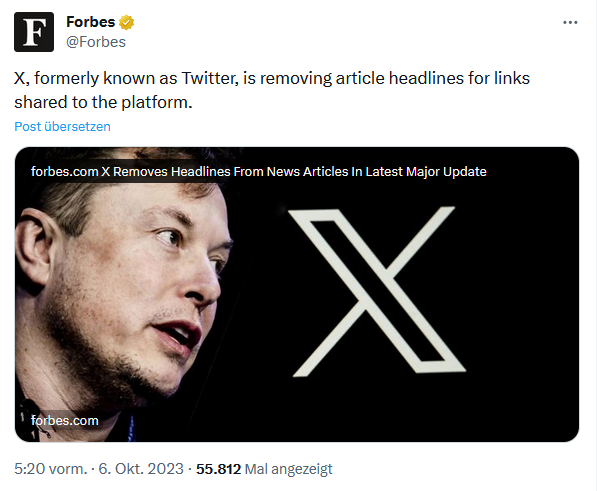

# Add headlines back to Twitter
A ViolentMonkey/TamperMonkey/GreaseMonkey script for adding article headlines back to Twitter.

Before:

After:

## How to use it

Take the script from `script.js` and add it to ViolentMonkey/TamperMonkey/GreaseMonkey. If you do not know how to do this, you probably should not be downloading scripts from the Internet and adding them to your browser. I only tested it with ViolentMonkey.

## How does it work

Twitter removed the article headlines from tweets, but they kept the `aria-label` on the links. This script takes the `aria-label` and displays it on the image.

## Contributing

Issues are disabled for now because this is just a small script I wrote in one evening, and I do not intend to put any effort into implementing feature requests. But if you do want some improvements, feel free to implement them yourself and contribute them via pull requests.
